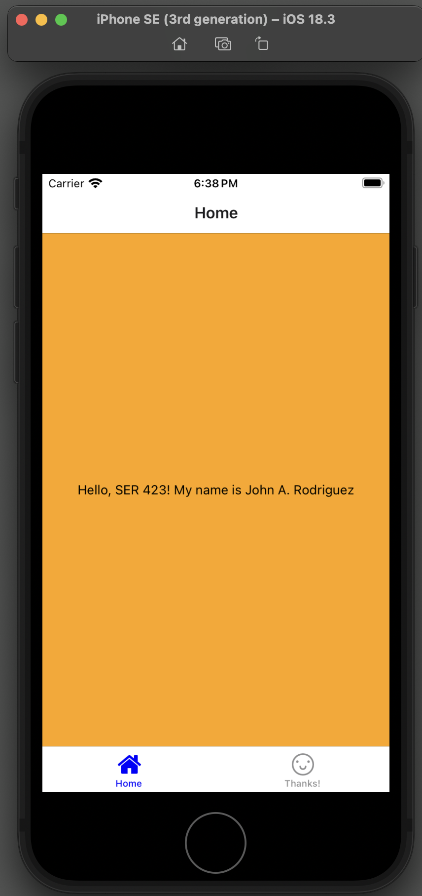
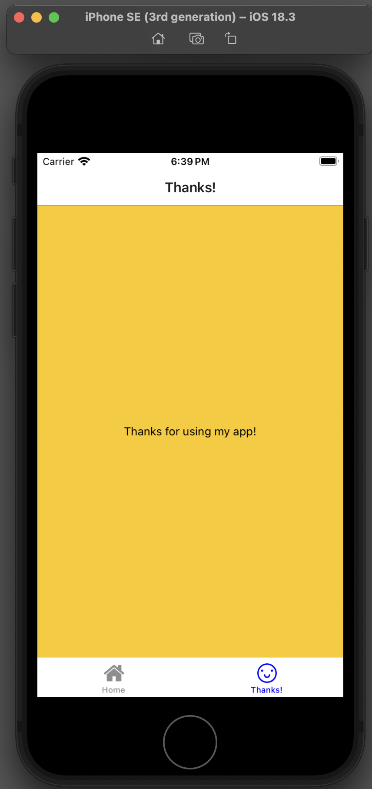

## Installation & Setup

### 1. Prerequisites
Make sure you have the following installed:
- Node.js (Download from [nodejs.org](https://nodejs.org/))
- Verify expo cli is installed `npx expo -h`
- Emulator of your choice (Android or iOS)

### 2. Building and Running app
- Change to app directory `cd Rodriguez-Assignment1`
- Install dependencies `npm install`
- Start the emulator of your choice - in mac you can use `open -a Simulator` in terminal
- Start expo server `npx expo start`
- Type `i` in terminal to open your app in the emulator

### 3. Screenshots
- Home screen showing same message as `Module 1: Project 1`

